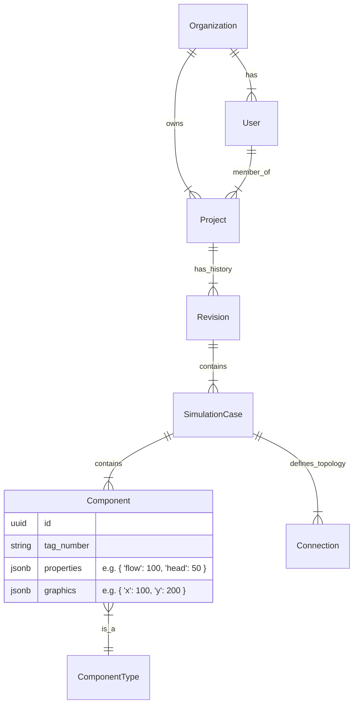

# Database Schema Design: Process Engineering Suite

## Overview
This document outlines a scalable database schema for a Process Engineering Suite. The design prioritizes **flexibility**, **interoperability**, and **data integrity**. It uses a hybrid approach: strict relational structure for core entities (Users, Projects) and flexible JSON storage for engineering data (Equipment, Streams) to accommodate various application modules (Network Editor, PSV, Pump, Vessel).

**Recommended Database**: PostgreSQL (for robust relational features + excellent JSONB support).

## Core Concepts

1.  **Centralized Identity & Projects**: Users and Projects are shared across all apps.
2.  **Module-Agnostic Component Storage**: Instead of creating `psv_table`, `pump_table`, etc., we use a generic `Components` table with a `type` discriminator and a `properties` JSONB column. This allows adding new equipment types without schema migrations.
3.  **Revision Control**: Engineering data requires strict versioning (Rev A, Rev B, Rev 0).
4.  **Topology**: Network connections (Nodes/Pipes) are stored as relationships.

## Entity Relationship Diagram (ERD)

## Schema Definitions

### 1. Identity & Access Management (IAM)

| Table | Description | Key Columns |
| :--- | :--- | :--- |
| **`organizations`** | Tenant/Company root. | `id`, `name`, `plan_tier` |
| **`users`** | Global users. | `id`, `email`, `password_hash`, `org_id` |
| **`project_members`** | Access control. | `project_id`, `user_id`, `role` (owner, editor, viewer) |

### 2. Project Structure

| Table | Description | Key Columns |
| :--- | :--- | :--- |
| **`projects`** | The main container. | `id`, `org_id`, `name`, `description`, `created_at` |
| **`revisions`** | Version history. | `id`, `project_id`, `rev_code` (A, B, 0), `status` (WIP, Issued), `locked_at` |
| **`cases`** | Simulation scenarios (e.g., "Design Case", "Max Flow"). | `id`, `revision_id`, `name`, `description`, `app_module` (NetworkEditor, PSV, etc.) |

### 3. Engineering Data (The "Expandable" Part)

This is where the design shines for a multi-app suite.

#### `component_types`
Metadata about what equipment exists.
*   `code`: "PIPE", "NODE", "PSV", "PUMP", "VESSEL"
*   `schema_definition`: JSON schema to validate the `properties` field.

#### `components`
The actual instances of equipment in a case.
*   `id`: UUID
*   `case_id`: FK to `cases`
*   `type_code`: FK to `component_types`
*   `tag`: String (e.g., "P-101")
*   **`properties` (JSONB)**: Stores all physics/process data.
    *   *Example (Pipe)*: `{ "length": 100, "diameter": 4, "roughness": 0.045 }`
    *   *Example (PSV)*: `{ "set_pressure": 150, "orifice_area": 1.2 }`
*   **`graphics` (JSONB)**: Stores UI data (x, y, rotation, color).

#### `connections`
Defines the topology (Flowsheet).
*   `id`: UUID
*   `case_id`: FK
*   `source_component_id`: FK
*   `target_component_id`: FK
*   `source_port`: String (optional, e.g., "outlet_nozzle")
*   `target_port`: String (optional, e.g., "inlet_nozzle")

### 4. Shared Libraries (Master Data)

| Table | Description | Key Columns |
| :--- | :--- | :--- |
| **`fluid_library`** | Standard fluids. | `id`, `name`, `properties` (JSONB: density, viscosity curves) |
| **`material_library`** | Piping materials. | `id`, `name`, `roughness`, `schedule_data` |

## API Design Strategy

To support external platforms, expose a REST or GraphQL API that interacts with these "Cases".

*   **GET /api/projects/{id}/cases/{caseId}/components**: Returns full equipment list.
*   **POST /api/simulation/run**: Accepts a Case ID, fetches `components` + `connections`, builds the graph, runs the calculation (e.g., your Network Editor logic), and updates the `properties` JSONB with results.

## Why this is "Best" for your use case?

1.  **Single Source of Truth**: All apps (PSV, Pump, Network) read from the same `projects` and `components` tables.
2.  **No Schema Migrations**: When you build the "Vessel Design" app, you don't need to create new tables. You just define a new `component_type` and start saving JSON data.
3.  **High Performance**: PostgreSQL JSONB allows indexing. You can query "Find all PSVs where set_pressure > 100 bar" efficiently, even though it's inside JSON.
4.  **Version Control**: The `revisions` table allows you to "Snapshot" an entire design at a specific point in time, which is crucial for engineering deliverables.
