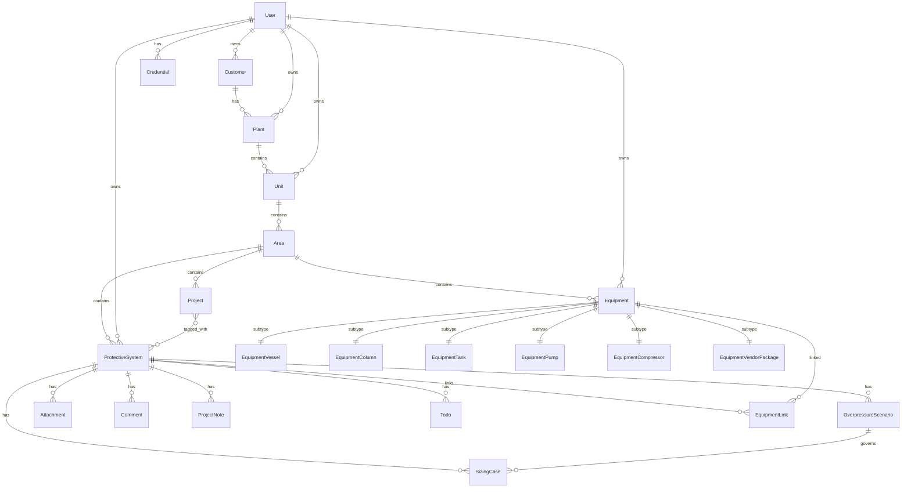

# PSV Database Schema (Current)

This document reflects the current SQLAlchemy model definitions under `services/api/app/models`.

- Generated on: 2026-02-24
- Source of truth: application models + Alembic migrations in `services/api/alembic/versions`

## Entity Relationship Overview

```mermaid
erDiagram
    Customer ||--o{ Plant : has
    Plant ||--o{ Unit : contains
    Unit ||--o{ Area : contains
    Area ||--o{ Project : contains
    Area ||--o{ ProtectiveSystem : contains
    Area ||--o{ Equipment : contains
    ProtectiveSystem ||--o{ OverpressureScenario : has
    ProtectiveSystem ||--o{ SizingCase : has
    ProtectiveSystem ||--o{ Attachment : has
    ProtectiveSystem ||--o{ Comment : has
    ProtectiveSystem ||--o{ ProjectNote : has
    ProtectiveSystem ||--o{ Todo : has
    ProtectiveSystem ||--o{ EquipmentLink : links
    OverpressureScenario ||--o{ SizingCase : governs
    Equipment ||--o{ EquipmentLink : linked
    User ||--o{ Credential : has
    User ||--o{ Customer : owns
    User ||--o{ Plant : owns
    User ||--o{ Unit : owns
    User ||--o{ Equipment : owns
    User ||--o{ ProtectiveSystem : owns
    Project }o--o{ ProtectiveSystem : tagged_with
    Equipment ||--|| EquipmentVessel : subtype
    Equipment ||--|| EquipmentColumn : subtype
    Equipment ||--|| EquipmentTank : subtype
    Equipment ||--|| EquipmentPump : subtype
    Equipment ||--|| EquipmentCompressor : subtype
    Equipment ||--|| EquipmentVendorPackage : subtype
```

## Tables

### `areas`

| Column | Type | Null | PK | FK | Default |
|---|---|---|---|---|---|
| unit_id | UUID | NO | NO | units.id |  |
| name | VARCHAR(255) | NO | NO |  |  |
| code | VARCHAR(50) | NO | NO |  |  |
| status | VARCHAR(8) | NO | NO |  | active |
| id | UUID | NO | YES |  | uuid4() |
| created_at | DATETIME | NO | NO |  | now() |
| updated_at | DATETIME | NO | NO |  | now() |

- Primary key: `id`
- Unique: `uq_areas_unit_id_code` on `unit_id, code`

### `attachments`

| Column | Type | Null | PK | FK | Default |
|---|---|---|---|---|---|
| protective_system_id | UUID | NO | NO | protective_systems.id |  |
| file_uri | VARCHAR(1000) | NO | NO |  |  |
| file_name | VARCHAR(255) | NO | NO |  |  |
| mime_type | VARCHAR(100) | NO | NO |  |  |
| size | INTEGER | NO | NO |  |  |
| uploaded_by | UUID | NO | NO | users.id |  |
| id | UUID | NO | YES |  | uuid4() |
| created_at | DATETIME | NO | NO |  | now() |
| updated_at | DATETIME | NO | NO |  | now() |

- Primary key: `id`

### `audit_logs`

| Column | Type | Null | PK | FK | Default |
|---|---|---|---|---|---|
| action | VARCHAR(13) | NO | NO |  |  |
| entity_type | VARCHAR(17) | NO | NO |  |  |
| entity_id | UUID | NO | NO |  |  |
| entity_name | VARCHAR(255) | NO | NO |  |  |
| user_id | UUID | NO | NO |  |  |
| user_name | VARCHAR(255) | NO | NO |  |  |
| user_role | VARCHAR(50) | YES | NO |  |  |
| changes | JSONB | YES | NO |  |  |
| description | TEXT | YES | NO |  |  |
| project_id | UUID | YES | NO |  |  |
| project_name | VARCHAR(255) | YES | NO |  |  |
| created_at | DATETIME | NO | NO |  | now() |
| id | UUID | NO | YES |  | uuid4() |
| updated_at | DATETIME | NO | NO |  | now() |

- Primary key: `id`
- Index: `ix_audit_logs_action` on `action`
- Index: `ix_audit_logs_created_at` on `created_at`
- Index: `ix_audit_logs_entity_id` on `entity_id`
- Index: `ix_audit_logs_entity_type` on `entity_type`
- Index: `ix_audit_logs_project_id` on `project_id`
- Index: `ix_audit_logs_user_id` on `user_id`

### `comments`

| Column | Type | Null | PK | FK | Default |
|---|---|---|---|---|---|
| protective_system_id | UUID | NO | NO | protective_systems.id |  |
| body | TEXT | NO | NO |  |  |
| created_by | UUID | NO | NO | users.id |  |
| updated_by | UUID | YES | NO | users.id |  |
| is_active | BOOLEAN | NO | NO |  | True |
| id | UUID | NO | YES |  | uuid4() |
| created_at | DATETIME | NO | NO |  | now() |
| updated_at | DATETIME | NO | NO |  | now() |

- Primary key: `id`

### `credentials`

| Column | Type | Null | PK | FK | Default |
|---|---|---|---|---|---|
| user_id | UUID | NO | NO | users.id |  |
| username | VARCHAR(100) | NO | NO |  |  |
| password_hash | VARCHAR(255) | NO | NO |  |  |
| last_login | DATETIME | YES | NO |  |  |
| failed_attempts | INTEGER | NO | NO |  | 0 |
| locked_until | DATETIME | YES | NO |  |  |
| id | UUID | NO | YES |  | uuid4() |
| created_at | DATETIME | NO | NO |  | now() |
| updated_at | DATETIME | NO | NO |  | now() |

- Primary key: `id`
- Unique: `(unnamed)` on `username`

### `customers`

| Column | Type | Null | PK | FK | Default |
|---|---|---|---|---|---|
| name | VARCHAR(255) | NO | NO |  |  |
| code | VARCHAR(50) | NO | NO |  |  |
| status | VARCHAR(8) | NO | NO |  | active |
| owner_id | UUID | NO | NO | users.id |  |
| id | UUID | NO | YES |  | uuid4() |
| created_at | DATETIME | NO | NO |  | now() |
| updated_at | DATETIME | NO | NO |  | now() |

- Primary key: `id`
- Unique: `(unnamed)` on `code`

### `equipment`

| Column | Type | Null | PK | FK | Default |
|---|---|---|---|---|---|
| area_id | UUID | NO | NO | areas.id |  |
| type | VARCHAR(14) | NO | NO |  |  |
| tag | VARCHAR(100) | NO | NO |  |  |
| name | VARCHAR(255) | NO | NO |  |  |
| description | TEXT | YES | NO |  |  |
| design_pressure | NUMERIC(10, 2) | YES | NO |  |  |
| design_pressure_unit | VARCHAR(20) | YES | NO |  | barg |
| mawp | NUMERIC(10, 2) | YES | NO |  |  |
| mawp_unit | VARCHAR(20) | YES | NO |  | barg |
| design_temp | NUMERIC(10, 2) | YES | NO |  |  |
| design_temp_unit | VARCHAR(20) | YES | NO |  | C |
| owner_id | UUID | NO | NO | users.id |  |
| is_active | BOOLEAN | NO | NO |  | True |
| status | VARCHAR(8) | NO | NO |  | active |
| location_ref | VARCHAR(255) | YES | NO |  |  |
| details | JSONB | YES | NO |  |  |
| id | UUID | NO | YES |  | uuid4() |
| created_at | DATETIME | NO | NO |  | now() |
| updated_at | DATETIME | NO | NO |  | now() |

- Primary key: `id`
- Unique: `uq_equipment_area_id_tag` on `area_id, tag`
- Index: `ix_equipment_tag` on `tag`

### `equipment_columns`

| Column | Type | Null | PK | FK | Default |
|---|---|---|---|---|---|
| equipment_id | UUID | NO | YES | equipment.id |  |
| inner_diameter_mm | NUMERIC | YES | NO |  |  |
| tangent_to_tangent_height_mm | NUMERIC | YES | NO |  |  |
| head_type | TEXT | YES | NO |  |  |
| wall_thickness_mm | NUMERIC | YES | NO |  |  |
| insulated | BOOLEAN | YES | NO |  |  |
| insulation_type | TEXT | YES | NO |  |  |
| insulation_thickness_mm | NUMERIC | YES | NO |  |  |
| normal_liquid_level_pct | NUMERIC | YES | NO |  |  |
| low_liquid_level_pct | NUMERIC | YES | NO |  |  |
| high_liquid_level_pct | NUMERIC | YES | NO |  |  |
| number_of_trays | INTEGER | YES | NO |  |  |
| tray_spacing_mm | NUMERIC | YES | NO |  |  |
| column_type | TEXT | YES | NO |  |  |
| packing_height_mm | NUMERIC | YES | NO |  |  |
| wetted_area_m2 | NUMERIC | YES | NO |  |  |
| total_surface_area_m2 | NUMERIC | YES | NO |  |  |
| volume_m3 | NUMERIC | YES | NO |  |  |
| extra | JSONB | YES | NO |  |  |

- Primary key: `equipment_id`

### `equipment_compressors`

| Column | Type | Null | PK | FK | Default |
|---|---|---|---|---|---|
| equipment_id | UUID | NO | YES | equipment.id |  |
| compressor_type | TEXT | YES | NO |  |  |
| rated_capacity_m3h | NUMERIC | YES | NO |  |  |
| standard_capacity_nm3h | NUMERIC | YES | NO |  |  |
| suction_pressure_barg | NUMERIC | YES | NO |  |  |
| discharge_pressure_barg | NUMERIC | YES | NO |  |  |
| compression_ratio | NUMERIC | YES | NO |  |  |
| suction_temperature_c | NUMERIC | YES | NO |  |  |
| discharge_temperature_c | NUMERIC | YES | NO |  |  |
| efficiency_pct | NUMERIC | YES | NO |  |  |
| motor_power_kw | NUMERIC | YES | NO |  |  |
| surge_flow_m3h | NUMERIC | YES | NO |  |  |
| anti_surge_valve_setpoint_pct | NUMERIC | YES | NO |  |  |
| extra | JSONB | YES | NO |  |  |

- Primary key: `equipment_id`

### `equipment_links`

| Column | Type | Null | PK | FK | Default |
|---|---|---|---|---|---|
| protective_system_id | UUID | NO | NO | protective_systems.id |  |
| equipment_id | UUID | NO | NO | equipment.id |  |
| is_primary | BOOLEAN | NO | NO |  | False |
| scenario_id | UUID | YES | NO | overpressure_scenarios.id |  |
| relationship_type | VARCHAR(12) | NO | NO |  | protects |
| notes | TEXT | YES | NO |  |  |
| id | UUID | NO | YES |  | uuid4() |
| created_at | DATETIME | NO | NO |  | now() |
| updated_at | DATETIME | NO | NO |  | now() |

- Primary key: `id`

### `equipment_pumps`

| Column | Type | Null | PK | FK | Default |
|---|---|---|---|---|---|
| equipment_id | UUID | NO | YES | equipment.id |  |
| pump_type | TEXT | YES | NO |  |  |
| rated_flow_m3h | NUMERIC | YES | NO |  |  |
| rated_head_m | NUMERIC | YES | NO |  |  |
| max_discharge_pressure_barg | NUMERIC | YES | NO |  |  |
| shutoff_head_m | NUMERIC | YES | NO |  |  |
| npsh_required_m | NUMERIC | YES | NO |  |  |
| efficiency_pct | NUMERIC | YES | NO |  |  |
| motor_power_kw | NUMERIC | YES | NO |  |  |
| relief_valve_set_pressure_barg | NUMERIC | YES | NO |  |  |
| max_viscosity_cp | NUMERIC | YES | NO |  |  |
| suction_pressure_barg | NUMERIC | YES | NO |  |  |
| discharge_pressure_barg | NUMERIC | YES | NO |  |  |
| fluid_temperature_c | NUMERIC | YES | NO |  |  |
| fluid_density_kgm3 | NUMERIC | YES | NO |  |  |
| extra | JSONB | YES | NO |  |  |

- Primary key: `equipment_id`

### `equipment_tanks`

| Column | Type | Null | PK | FK | Default |
|---|---|---|---|---|---|
| equipment_id | UUID | NO | YES | equipment.id |  |
| tank_type | TEXT | YES | NO |  |  |
| orientation | TEXT | YES | NO |  |  |
| inner_diameter_mm | NUMERIC | YES | NO |  |  |
| height_mm | NUMERIC | YES | NO |  |  |
| roof_type | TEXT | YES | NO |  |  |
| wall_thickness_mm | NUMERIC | YES | NO |  |  |
| insulated | BOOLEAN | YES | NO |  |  |
| insulation_type | TEXT | YES | NO |  |  |
| insulation_thickness_mm | NUMERIC | YES | NO |  |  |
| normal_liquid_level_pct | NUMERIC | YES | NO |  |  |
| low_liquid_level_pct | NUMERIC | YES | NO |  |  |
| high_liquid_level_pct | NUMERIC | YES | NO |  |  |
| wetted_area_m2 | NUMERIC | YES | NO |  |  |
| volume_m3 | NUMERIC | YES | NO |  |  |
| heel_volume_m3 | NUMERIC | YES | NO |  |  |
| extra | JSONB | YES | NO |  |  |

- Primary key: `equipment_id`

### `equipment_vendor_packages`

| Column | Type | Null | PK | FK | Default |
|---|---|---|---|---|---|
| equipment_id | UUID | NO | YES | equipment.id |  |
| vendor_name | TEXT | YES | NO |  |  |
| package_name | TEXT | YES | NO |  |  |
| package_description | TEXT | YES | NO |  |  |
| extra | JSONB | YES | NO |  |  |

- Primary key: `equipment_id`

### `equipment_vessels`

| Column | Type | Null | PK | FK | Default |
|---|---|---|---|---|---|
| equipment_id | UUID | NO | YES | equipment.id |  |
| orientation | TEXT | YES | NO |  |  |
| inner_diameter_mm | NUMERIC | YES | NO |  |  |
| tangent_to_tangent_length_mm | NUMERIC | YES | NO |  |  |
| head_type | TEXT | YES | NO |  |  |
| wall_thickness_mm | NUMERIC | YES | NO |  |  |
| insulated | BOOLEAN | YES | NO |  |  |
| insulation_type | TEXT | YES | NO |  |  |
| insulation_thickness_mm | NUMERIC | YES | NO |  |  |
| normal_liquid_level_pct | NUMERIC | YES | NO |  |  |
| low_liquid_level_pct | NUMERIC | YES | NO |  |  |
| high_liquid_level_pct | NUMERIC | YES | NO |  |  |
| wetted_area_m2 | NUMERIC | YES | NO |  |  |
| total_surface_area_m2 | NUMERIC | YES | NO |  |  |
| volume_m3 | NUMERIC | YES | NO |  |  |
| extra | JSONB | YES | NO |  |  |

- Primary key: `equipment_id`

### `overpressure_scenarios`

| Column | Type | Null | PK | FK | Default |
|---|---|---|---|---|---|
| protective_system_id | UUID | NO | NO | protective_systems.id |  |
| cause | VARCHAR(21) | NO | NO |  |  |
| description | TEXT | YES | NO |  |  |
| relieving_temp | NUMERIC(10, 2) | NO | NO |  |  |
| relieving_pressure | NUMERIC(10, 2) | NO | NO |  |  |
| phase | VARCHAR(9) | NO | NO |  |  |
| relieving_rate | NUMERIC(12, 2) | NO | NO |  |  |
| accumulation_pct | NUMERIC(5, 2) | NO | NO |  |  |
| required_capacity | NUMERIC(12, 2) | NO | NO |  |  |
| assumptions | ARRAY | NO | NO |  | <function list at 0x10966bec0> |
| code_refs | ARRAY | NO | NO |  | <function list at 0x1096a2c00> |
| is_governing | BOOLEAN | NO | NO |  | False |
| case_consideration | TEXT | YES | NO |  |  |
| is_active | BOOLEAN | NO | NO |  | True |
| current_revision_id | UUID | YES | NO | revision_history.id |  |
| id | UUID | NO | YES |  | uuid4() |
| created_at | DATETIME | NO | NO |  | now() |
| updated_at | DATETIME | NO | NO |  | now() |

- Primary key: `id`

### `plants`

| Column | Type | Null | PK | FK | Default |
|---|---|---|---|---|---|
| customer_id | UUID | NO | NO | customers.id |  |
| name | VARCHAR(255) | NO | NO |  |  |
| code | VARCHAR(50) | NO | NO |  |  |
| location | VARCHAR(255) | YES | NO |  |  |
| status | VARCHAR(8) | NO | NO |  | active |
| owner_id | UUID | NO | NO | users.id |  |
| id | UUID | NO | YES |  | uuid4() |
| created_at | DATETIME | NO | NO |  | now() |
| updated_at | DATETIME | NO | NO |  | now() |

- Primary key: `id`
- Unique: `uq_plants_customer_id_code` on `customer_id, code`

### `project_notes`

| Column | Type | Null | PK | FK | Default |
|---|---|---|---|---|---|
| protective_system_id | UUID | NO | NO | protective_systems.id |  |
| body | TEXT | NO | NO |  |  |
| created_by | UUID | NO | NO | users.id |  |
| updated_by | UUID | YES | NO | users.id |  |
| is_active | BOOLEAN | NO | NO |  | True |
| id | UUID | NO | YES |  | uuid4() |
| created_at | DATETIME | NO | NO |  | now() |
| updated_at | DATETIME | NO | NO |  | now() |

- Primary key: `id`

### `projects`

| Column | Type | Null | PK | FK | Default |
|---|---|---|---|---|---|
| area_id | UUID | NO | NO | areas.id |  |
| name | VARCHAR(255) | NO | NO |  |  |
| code | VARCHAR(50) | NO | NO |  |  |
| phase | VARCHAR(13) | NO | NO |  | design |
| status | VARCHAR(9) | NO | NO |  | draft |
| start_date | DATE | NO | NO |  |  |
| end_date | DATE | YES | NO |  |  |
| lead_id | UUID | NO | NO | users.id |  |
| unit_system | VARCHAR(32) | NO | NO |  | metric |
| is_active | BOOLEAN | NO | NO |  | True |
| id | UUID | NO | YES |  | uuid4() |
| created_at | DATETIME | NO | NO |  | now() |
| updated_at | DATETIME | NO | NO |  | now() |

- Primary key: `id`
- Unique: `uq_projects_area_id_code` on `area_id, code`

### `protective_system_projects`

| Column | Type | Null | PK | FK | Default |
|---|---|---|---|---|---|
| protective_system_id | UUID | NO | YES | protective_systems.id |  |
| project_id | UUID | NO | YES | projects.id |  |

- Primary key: `protective_system_id, project_id`

### `protective_systems`

| Column | Type | Null | PK | FK | Default |
|---|---|---|---|---|---|
| area_id | UUID | NO | NO | areas.id |  |
| name | VARCHAR(255) | NO | NO |  |  |
| tag | VARCHAR(100) | NO | NO |  |  |
| type | VARCHAR(14) | NO | NO |  | psv |
| design_code | VARCHAR(9) | NO | NO |  | API-520 |
| service_fluid | VARCHAR(255) | YES | NO |  |  |
| fluid_phase | VARCHAR(9) | NO | NO |  | gas |
| set_pressure | NUMERIC(10, 2) | NO | NO |  |  |
| mawp | NUMERIC(10, 2) | NO | NO |  |  |
| owner_id | UUID | NO | NO | users.id |  |
| status | VARCHAR(9) | NO | NO |  | draft |
| valve_type | VARCHAR(16) | YES | NO |  |  |
| tags | ARRAY | NO | NO |  | <function list at 0x10966aca0> |
| project_tags | ARRAY | YES | NO |  |  |
| version | INTEGER | NO | NO |  | 1 |
| current_revision_id | UUID | YES | NO | revision_history.id |  |
| inlet_network | JSONB | YES | NO |  |  |
| outlet_network | JSONB | YES | NO |  |  |
| is_active | BOOLEAN | NO | NO |  | True |
| id | UUID | NO | YES |  | uuid4() |
| created_at | DATETIME | NO | NO |  | now() |
| updated_at | DATETIME | NO | NO |  | now() |
| deleted_at | DATETIME | YES | NO |  |  |

- Primary key: `id`
- Unique: `uq_protective_systems_area_id_tag` on `area_id, tag`
- Check: `ck_protective_systems_deleted_at_matches_is_active` = `(deleted_at IS NULL) = is_active`
- Index: `ix_protective_systems_tag` on `tag`

### `revision_history`

| Column | Type | Null | PK | FK | Default |
|---|---|---|---|---|---|
| is_active | BOOLEAN | NO | NO |  | True |
| entity_type | VARCHAR(32) | NO | NO |  |  |
| entity_id | UUID | NO | NO |  |  |
| revision_code | VARCHAR(16) | NO | NO |  |  |
| sequence | INTEGER | NO | NO |  |  |
| description | TEXT | YES | NO |  |  |
| originated_by | UUID | YES | NO | users.id |  |
| originated_at | DATETIME | YES | NO |  |  |
| checked_by | UUID | YES | NO | users.id |  |
| checked_at | DATETIME | YES | NO |  |  |
| approved_by | UUID | YES | NO | users.id |  |
| approved_at | DATETIME | YES | NO |  |  |
| issued_at | DATETIME | YES | NO |  |  |
| snapshot | JSONB | NO | NO |  |  |
| created_at | DATETIME | NO | NO |  | now() |
| id | UUID | NO | YES |  | uuid4() |

- Primary key: `id`

### `sizing_cases`

| Column | Type | Null | PK | FK | Default |
|---|---|---|---|---|---|
| protective_system_id | UUID | NO | NO | protective_systems.id |  |
| scenario_id | UUID | YES | NO | overpressure_scenarios.id |  |
| standard | VARCHAR(9) | NO | NO |  | API-520 |
| method | VARCHAR(9) | NO | NO |  |  |
| inputs | JSONB | NO | NO |  | <function dict at 0x1096c9300> |
| outputs | JSONB | NO | NO |  | <function dict at 0x1096c94e0> |
| unit_preferences | JSONB | YES | NO |  |  |
| is_active | BOOLEAN | NO | NO |  | True |
| current_revision_id | UUID | YES | NO | revision_history.id |  |
| status | VARCHAR(10) | NO | NO |  | draft |
| created_by | UUID | NO | NO | users.id |  |
| approved_by | UUID | YES | NO | users.id |  |
| id | UUID | NO | YES |  | uuid4() |
| created_at | DATETIME | NO | NO |  | now() |
| updated_at | DATETIME | NO | NO |  | now() |

- Primary key: `id`

### `todos`

| Column | Type | Null | PK | FK | Default |
|---|---|---|---|---|---|
| protective_system_id | UUID | NO | NO | protective_systems.id |  |
| text | VARCHAR(500) | NO | NO |  |  |
| completed | BOOLEAN | NO | NO |  | False |
| assigned_to | UUID | YES | NO | users.id |  |
| due_date | DATE | YES | NO |  |  |
| created_by | UUID | NO | NO | users.id |  |
| is_active | BOOLEAN | NO | NO |  | True |
| id | UUID | NO | YES |  | uuid4() |
| created_at | DATETIME | NO | NO |  | now() |
| updated_at | DATETIME | NO | NO |  | now() |

- Primary key: `id`

### `units`

| Column | Type | Null | PK | FK | Default |
|---|---|---|---|---|---|
| plant_id | UUID | NO | NO | plants.id |  |
| name | VARCHAR(255) | NO | NO |  |  |
| code | VARCHAR(50) | NO | NO |  |  |
| service | VARCHAR(255) | YES | NO |  |  |
| status | VARCHAR(8) | NO | NO |  | active |
| owner_id | UUID | NO | NO | users.id |  |
| id | UUID | NO | YES |  | uuid4() |
| created_at | DATETIME | NO | NO |  | now() |
| updated_at | DATETIME | NO | NO |  | now() |

- Primary key: `id`
- Unique: `uq_units_plant_id_code` on `plant_id, code`

### `users`

| Column | Type | Null | PK | FK | Default |
|---|---|---|---|---|---|
| name | VARCHAR(255) | NO | NO |  |  |
| initials | VARCHAR(16) | YES | NO |  |  |
| email | VARCHAR(255) | NO | NO |  |  |
| role | VARCHAR(16) | NO | NO |  | engineer |
| status | VARCHAR(8) | NO | NO |  | active |
| display_settings | JSONB | YES | NO |  |  |
| id | UUID | NO | YES |  | uuid4() |
| created_at | DATETIME | NO | NO |  | now() |
| updated_at | DATETIME | NO | NO |  | now() |

- Primary key: `id`
- Unique: `(unnamed)` on `email`

## Migration-Defined Constraints and Indexes

- `revision_history`: unique constraint `uq_revision_entity_code` on `(entity_type, entity_id, revision_code)` from Alembic revision `add_revision_history`.
- `revision_history`: index `ix_revision_history_entity` on `(entity_type, entity_id)` from Alembic revision `add_revision_history`.

## Enum Values (application-level)

- `user_role`: engineer, lead, approver, division_manager, admin, viewer
- `user_status`: active, inactive
- `customer_status`: active, inactive
- `plant_status`: active, inactive
- `unit_status`: active, inactive
- `area_status`: active, inactive
- `project_phase`: design, construction, commissioning, operation
- `project_status`: draft, in_review, checked, approved, issued
- `equipment_type`: vessel, tank, heat_exchanger, column, reactor, pump, compressor, piping, vendor_package, other
- `equipment_status`: active, inactive
- `protective_system_type`: psv, rupture_disc, breather_valve, flame_arrestor, tank_vent, control_valve, vent_system, prv
- `design_code`: API-520, API-521, API-2000, ASME-VIII
- `fluid_phase`: gas, liquid, steam, two_phase
- `psv_status`: draft, in_review, checked, approved, issued
- `valve_operating_type`: conventional, balanced_bellows, pilot_operated
- `scenario_cause`: blocked_outlet, fire_case, external_fire, tube_rupture, thermal_expansion, utility_failure, control_valve_failure, power_failure, cooling_water_failure, reflux_failure, abnormal_heat_input, check_valve_failure, other
- `scenario_phase`: gas, liquid, steam, two_phase
- `sizing_standard`: API-520, API-521, API-2000, ASME-VIII, ISO-4126
- `sizing_method`: gas, liquid, steam, two_phase
- `sizing_status`: draft, calculated, verified, approved
- `equipment_relationship`: protects, inlet_from, discharge_to
- `audit_action`: create, update, delete, status_change, calculate
- `audit_entity_type`: protective_system, scenario, sizing_case, project, revision, comment, attachment, note, todo
