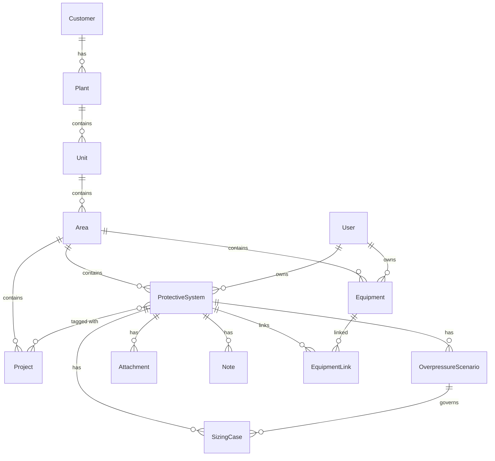

# PSV Application Database Schema

This document describes the proposed database schema for the PSV sizing application.

## Entity Relationship Diagram



---

## Tables

### Hierarchy Tables

#### `customers`
| Column | Type | Description |
|--------|------|-------------|
| id | UUID | Primary key |
| name | VARCHAR(255) | Customer name |
| code | VARCHAR(50) | Short code |
| status | ENUM('active', 'inactive') | Status |
| owner_id | UUID | FK → users.id |
| created_at | TIMESTAMP | Creation time |

#### `plants`
| Column | Type | Description |
|--------|------|-------------|
| id | UUID | Primary key |
| customer_id | UUID | FK → customers.id |
| name | VARCHAR(255) | Plant name |
| code | VARCHAR(50) | Short code |
| location | VARCHAR(255) | Geographic location |
| status | ENUM('active', 'inactive') | Status |
| owner_id | UUID | FK → users.id |
| created_at | TIMESTAMP | Creation time |

#### `units`
| Column | Type | Description |
|--------|------|-------------|
| id | UUID | Primary key |
| plant_id | UUID | FK → plants.id |
| name | VARCHAR(255) | Unit name |
| code | VARCHAR(50) | Short code (e.g., "CDU") |
| service | VARCHAR(255) | Service description |
| status | ENUM('active', 'inactive') | Status |
| owner_id | UUID | FK → users.id |
| created_at | TIMESTAMP | Creation time |

#### `areas`
| Column | Type | Description |
|--------|------|-------------|
| id | UUID | Primary key |
| unit_id | UUID | FK → units.id |
| name | VARCHAR(255) | Area name |
| code | VARCHAR(50) | Short code |
| status | ENUM('active', 'inactive') | Status |
| created_at | TIMESTAMP | Creation time |

#### `projects`
| Column | Type | Description |
|--------|------|-------------|
| id | UUID | Primary key |
| area_id | UUID | FK → areas.id |
| name | VARCHAR(255) | Project name |
| code | VARCHAR(50) | Project code |
| phase | ENUM('design', 'construction', 'commissioning', 'operation') | Phase |
| status | ENUM('draft', 'in_review', 'approved', 'issued') | Status |
| start_date | DATE | Start date |
| end_date | DATE | End date (nullable) |
| lead_id | UUID | FK → users.id |
| created_at | TIMESTAMP | Creation time |

---

### Core Tables

#### `protective_systems`
| Column | Type | Description |
|--------|------|-------------|
| id | UUID | Primary key |
| area_id | UUID | FK → areas.id |
| name | VARCHAR(255) | PSV name |
| tag | VARCHAR(100) | Tag number (e.g., "PSV-101") |
| type | ENUM('psv', 'rupture_disc', 'vent_system', 'prv') | Type |
| design_code | ENUM('API-520', 'API-521', 'API-2000', 'ASME-VIII') | Design code |
| service_fluid | VARCHAR(255) | Fluid name |
| fluid_phase | ENUM('gas', 'liquid', 'steam', 'two_phase') | Phase |
| set_pressure | DECIMAL(10,2) | Set pressure (barg) |
| mawp | DECIMAL(10,2) | Maximum allowable working pressure (barg) |
| owner_id | UUID | FK → users.id |
| status | ENUM('draft', 'in_review', 'checked', 'approved', 'issued') | Status |
| project_tags | UUID[] | Optional FK array → projects.id |
| tags | TEXT[] | Tags array |
| inlet_network | JSONB | Shared inlet piping configuration |
| outlet_network | JSONB | Shared outlet piping configuration |
| created_at | TIMESTAMP | Creation time |
| updated_at | TIMESTAMP | Last update |

#### `overpressure_scenarios`
| Column | Type | Description |
|--------|------|-------------|
| id | UUID | Primary key |
| protective_system_id | UUID | FK → protective_systems.id |
| cause | ENUM('blocked_outlet', 'fire_case', 'tube_rupture', ...) | Cause type |
| description | TEXT | Description |
| relieving_temp | DECIMAL(10,2) | Relieving temperature (°C) |
| relieving_pressure | DECIMAL(10,2) | Relieving pressure (barg) |
| phase | ENUM('gas', 'liquid', 'steam', 'two_phase') | Fluid phase |
| relieving_rate | DECIMAL(12,2) | Relieving rate (kg/h) |
| accumulation_pct | DECIMAL(5,2) | Accumulation (%) |
| required_capacity | DECIMAL(12,2) | Required capacity (kg/h) |
| assumptions | TEXT[] | Assumptions array |
| code_refs | TEXT[] | Code references array |
| is_governing | BOOLEAN | Is governing scenario |
| created_at | TIMESTAMP | Creation time |
| updated_at | TIMESTAMP | Last update |

#### `sizing_cases`
| Column | Type | Description |
|--------|------|-------------|
| id | UUID | Primary key |
| protective_system_id | UUID | FK → protective_systems.id |
| scenario_id | UUID | FK → overpressure_scenarios.id |
| standard | ENUM('API-520', 'API-521', 'API-2000', 'ASME-VIII', 'ISO-4126') | Standard |
| method | ENUM('gas', 'liquid', 'steam', 'two_phase') | Sizing method |
| inputs | JSONB | SizingInputs object |
| outputs | JSONB | SizingOutputs object |
| revision_no | INTEGER | Revision number |
| status | ENUM('draft', 'calculated', 'verified', 'approved') | Status |
| created_by | UUID | FK → users.id |
| approved_by | UUID | FK → users.id (nullable) |
| created_at | TIMESTAMP | Creation time |
| updated_at | TIMESTAMP | Last update |

---

### Supporting Tables

#### `equipment`
| Column | Type | Description |
|--------|------|-------------|
| id | UUID | Primary key |
| area_id | UUID | FK → areas.id |
| type | ENUM('vessel', 'tank', 'heat_exchanger', 'column', 'reactor', 'pump', 'compressor', 'piping', 'other') | Type |
| tag | VARCHAR(100) | Equipment tag |
| name | VARCHAR(255) | Equipment name |
| description | TEXT | Description |
| design_pressure | DECIMAL(10,2) | Design pressure (barg) |
| mawp | DECIMAL(10,2) | MAWP (barg) |
| design_temp | DECIMAL(10,2) | Design temperature (°C) |
| owner_id | UUID | FK → users.id |
| status | ENUM('active', 'inactive') | Status |
| location_ref | VARCHAR(255) | Location reference |
| created_at | TIMESTAMP | Creation time |
| updated_at | TIMESTAMP | Last update |

#### `equipment_links`
| Column | Type | Description |
|--------|------|-------------|
| id | UUID | Primary key |
| protective_system_id | UUID | FK → protective_systems.id |
| equipment_id | UUID | FK → equipment.id |
| is_primary | BOOLEAN | Is primary protection device |
| scenario_id | UUID | FK → overpressure_scenarios.id (nullable) |
| relationship | ENUM('protects', 'inlet_from', 'discharge_to') | Relationship type |
| notes | TEXT | Notes |
| created_at | TIMESTAMP | Creation time |

#### `attachments`
| Column | Type | Description |
|--------|------|-------------|
| id | UUID | Primary key |
| protective_system_id | UUID | FK → protective_systems.id |
| file_uri | VARCHAR(1000) | File storage URI |
| file_name | VARCHAR(255) | Original file name |
| mime_type | VARCHAR(100) | MIME type |
| size | INTEGER | File size in bytes |
| uploaded_by | UUID | FK → users.id |
| created_at | TIMESTAMP | Upload time |

#### `comments`
| Column | Type | Description |
|--------|------|-------------|
| id | UUID | Primary key |
| protective_system_id | UUID | FK → protective_systems.id |
| body | TEXT | Comment content |
| created_by | UUID | FK → users.id |
| created_at | TIMESTAMP | Creation time |
| updated_at | TIMESTAMP | Last update |

#### `todos`
| Column | Type | Description |
|--------|------|-------------|
| id | UUID | Primary key |
| protective_system_id | UUID | FK → protective_systems.id |
| text | VARCHAR(500) | Task description |
| completed | BOOLEAN | Completion status |
| assigned_to | UUID | FK → users.id (nullable) |
| due_date | DATE | Due date (nullable) |
| created_by | UUID | FK → users.id |
| created_at | TIMESTAMP | Creation time |

#### `users`
| Column | Type | Description |
|--------|------|-------------|
| id | UUID | Primary key |
| name | VARCHAR(255) | Display name |
| email | VARCHAR(255) | Email (unique) |
| role | ENUM('engineer', 'lead', 'approver', 'viewer') | Role |
| status | ENUM('active', 'inactive') | Status |

---

## Reference Tables

#### `orifice_sizes`
| Column | Type | Description |
|--------|------|-------------|
| designation | CHAR(1) | Orifice letter (D, E, F, ...) |
| area_mm2 | DECIMAL(10,2) | Area in mm² |
| area_in2 | DECIMAL(10,4) | Area in in² |

Pre-populated with API standard orifice sizes (D through T).

---

## Indexes

```sql
-- Hierarchy lookups
CREATE INDEX idx_plants_customer ON plants(customer_id);
CREATE INDEX idx_units_plant ON units(plant_id);
CREATE INDEX idx_areas_unit ON areas(unit_id);
CREATE INDEX idx_projects_area ON projects(area_id);

-- PSV lookups
CREATE INDEX idx_psv_area ON protective_systems(area_id);
CREATE INDEX idx_psv_tag ON protective_systems(tag);
CREATE INDEX idx_psv_project_tags ON protective_systems USING GIN(project_tags);
CREATE INDEX idx_scenarios_psv ON overpressure_scenarios(protective_system_id);
CREATE INDEX idx_sizing_psv ON sizing_cases(protective_system_id);
CREATE INDEX idx_sizing_scenario ON sizing_cases(scenario_id);

-- Equipment lookups
CREATE INDEX idx_equipment_area ON equipment(area_id);
CREATE INDEX idx_equipment_tag ON equipment(tag);
CREATE INDEX idx_equipment_links_psv ON equipment_links(protective_system_id);
CREATE INDEX idx_equipment_links_equip ON equipment_links(equipment_id);
```

---

## Notes

- **Database**: Recommended PostgreSQL 14+ for JSONB and array support
- **UUIDs**: Use `gen_random_uuid()` for ID generation
- **Soft Delete**: Consider adding `deleted_at` column for soft deletes
- **Audit Trail**: Consider `created_by`/`updated_by` for audit logging

---

## JSONB Structure: SizingInputs

The `sizing_cases.inputs` JSONB column contains the following structure (as of Dec 2025):

### Common Fields (All Methods)
```json
{
  "massFlowRate": number,        // kg/h (base unit)
  "temperature": number,          // °C (base unit)
  "pressure": number,             // barg (base unit)
  "backpressure": number,         // barg
  "backpressureType": "superimposed" | "built_up"
}
```

### Gas/Vapor Phase Properties
**Used by:** `gas`, `steam`, `two_phase`
```json
{
  "molecularWeight": number,      // g/mol (default 18.02 for steam)
  "compressibilityZ": number,     // dimensionless (0-2)
  "specificHeatRatio": number,    // k = Cp/Cv (1-2)
  "gasViscosity": number          // cP (optional)
}
```

### Liquid Phase Properties
**Used by:** `liquid`, `two_phase`
```json
{
  "liquidDensity": number,        // kg/m³
  "liquidViscosity": number       // cP
}
```

### Two-Phase Specific
**Used by:** `two_phase` only
```json
{
  "vaporFraction": number         // Mass vapor fraction 0-1 (aka quality x)
}
```

### Backward Compatibility Fields
**Deprecated but supported:**
```json
{
  "viscosity": number,            // Mapped to gasViscosity or liquidViscosity
  "density": number               // Mapped to liquidDensity
}
```

### Hydraulic Validation (Optional)
```json
{
  "backpressureSource": "manual" | "calculated",
  "calculatedBackpressure": number,  // barg (if calculated from outlet network)
  "inletPressureDrop": number        // kPa
}
```

### Complete Example: Two-Phase Case
```json
{
  "massFlowRate": 85000,
  "temperature": 180,
  "pressure": 2.8,
  "molecularWeight": 44,
  "compressibilityZ": 0.92,
  "specificHeatRatio": 1.15,
  "gasViscosity": 0.012,
  "liquidDensity": 850,
  "liquidViscosity": 1.2,
  "vaporFraction": 0.25,
  "backpressure": 0.5,
  "backpressureType": "superimposed"
}
```

