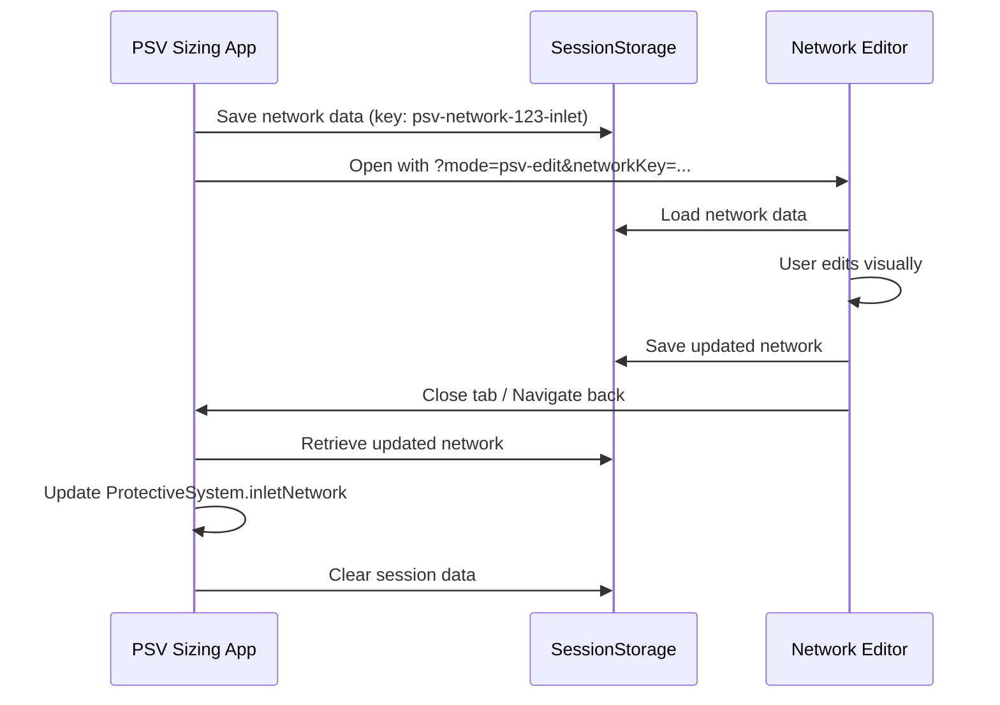

# Hydraulic Validation for PSV Sizing

## Overview
Integrate hydraulic calculations from inlet/outlet piping networks into PSV sizing to automatically calculate built-up backpressure and validate inlet pressure drop compliance.

## Engineering Background

### Built-up Backpressure
- **Definition**: Backpressure that develops in the discharge system **only after** the PSV opens
- **Calculation**: Sum of pressure drops through outlet piping (pipes, fittings, elevation)
- **Current Issue**: Currently a manual input field, but should be calculated from outlet network configuration

### Inlet Pressure Drop
- **API 520 Guideline**: Inlet pressure drop should be **< 3% of set pressure**
- **Reason**: Excessive inlet ΔP causes:
  - Valve chattering/instability
  - Reduced relieving capacity
  - Potential mechanical damage
- **Current Issue**: No validation or calculation

---

## Proposed Solution

### Phase 1: Calculation Engine

#### 1.1 Hydraulic Calculation Functions
**File**: `apps/psv/src/lib/hydraulicValidation.ts` (NEW)

```typescript
interface HydraulicResult {
  totalPressureDrop: number; // kPa
  velocityMax: number; // m/s
  pipes: {
    id: string;
    pressureDrop: number;
    velocity: number;
  }[];
}

/**
 * Calculate total pressure drop through a piping network
 */
export function calculateNetworkPressureDrop(
  network: PipelineNetwork,
  flowRate: number, // kg/h
  fluid: FluidProperties
): HydraulicResult;

/**
 * Validate inlet pressure drop against API 520 3% rule
 */
export function validateInletPressureDrop(
  inletDeltaP: number, // kPa
  setPressure: number // kPa (gauge)
): {
  isValid: boolean;
  percentOfSetPressure: number;
  message: string;
};
```

#### 1.2 Integration Points
- Reuse existing `recalculatePipeFittingLosses` from network-editor
- Convert pressure units consistently (kPa base)
- Handle both gas and liquid sizing methods

---

### Phase 2: Data Model Updates

#### 2.1 Extend `SizingInputs`
**File**: `apps/psv/src/data/types.ts`

```typescript
export interface SizingInputs {
  // ... existing fields
  
  // NEW: Hydraulic validation
  backpressureSource: 'manual' | 'calculated'; // Toggle mode
  inletPressureDrop?: number; // Calculated, kPa
  calculatedBackpressure?: number; // From outlet network, kPa
}
```

#### 2.2 Extend `SizingOutputs`
```typescript
export interface SizingOutputs {
  // ... existing fields
  
  // NEW: Validation results
  inletPressureDropPercent?: number; // % of set pressure
  inletValidation?: {
    isValid: boolean;
    message: string;
  };
}
```

---

### Phase 3: UI Implementation

#### 3.1 Backpressure Calculation Toggle
**Location**: `SizingWorkspace.tsx` - Backpressure Card

**Design**:
```
┌─────────────────────────────────────────────────┐
│ Backpressure                               (?)  │
│                                                  │
│ ○ Manual Entry                                  │
│   [0.5] [barg ▼]                                │
│                                                  │
│ ● Calculate from Outlet Piping                  │
│   Calculated: 0.8 barg                          │
│   (Based on 3 pipes, 125m total length)        │
│                                                  │
│ Type: [Superimposed ▼] [Built-up ▼]           │
└─────────────────────────────────────────────────┘
```

**Features**:
- Radio button to switch mode
- Show calculated value with pipe count/length summary
- Auto-recalculate when outlet network changes
- Disable manual input when in calculated mode

#### 3.2 Inlet Pressure Drop Validation
**Location**: `SizingWorkspace.tsx` - New "Hydraulic Validation" section

**Design**:
```
┌─────────────────────────────────────────────────┐
│ Hydraulic Validation                            │
│                                                  │
│ Inlet Pressure Drop                             │
│ ✓ 1.2 kPa (1.8% of set pressure)               │
│   API 520 guideline: < 3%                       │
│                                                  │
│ Outlet Backpressure (Built-up)                 │
│ ℹ 0.8 barg calculated                           │
│   Max velocity: 45 m/s                          │
└─────────────────────────────────────────────────┘
```

**Features**:
- Green checkmark if inlet ΔP < 3%
- Warning icon if 3-5%
- Error icon if > 5%
- Display absolute value and percentage
- Link to "Edit Inlet Piping" tab

#### 3.3 Warnings in Calculation Results
**Location**: `SizingWorkspace.tsx` - Calculation Tab

Add validation messages:
```typescript
{!currentCase.outputs?.inletValidation?.isValid && (
  <Alert severity="warning" sx={{ mb: 2 }}>
    <strong>Inlet Pressure Drop Warning:</strong> {currentCase.outputs.inletValidation.message}
    <br />
    Consider increasing inlet pipe diameter or reducing length.
  </Alert>
)}
```

---

### Phase 4: Calculation Workflow

#### 4.1 When to Recalculate
1. **On Inlet/Outlet Network Save** (`handleSaveNetworks`)
   - Calculate inlet ΔP
   - Calculate outlet ΔP (if mode = 'calculated')
   - Update `SizingInputs`
   
2. **On "Calculate Sizing" Button**
   - Use current hydraulic values
   - Run PSV sizing
   - Store validation results in `SizingOutputs`

3. **On Backpressure Mode Change**
   - Switch between manual/calculated
   - Preserve last manual value

#### 4.2 Calculation Sequence
```typescript
function performHydraulicValidation(case: SizingCase, psv: ProtectiveSystem) {
  // 1. Calculate inlet pressure drop
  const inletResult = calculateNetworkPressureDrop(
    psv.inletNetwork,
    case.inputs.massFlowRate,
    case.inputs.fluid
  );
  
  // 2. Validate inlet against 3% rule
  const inletValidation = validateInletPressureDrop(
    inletResult.totalPressureDrop,
    psv.setPressure
  );
  
  // 3. Calculate outlet backpressure (if mode = 'calculated')
  let backpressure = case.inputs.backpressure;
  if (case.inputs.backpressureSource === 'calculated') {
    const outletResult = calculateNetworkPressureDrop(
      psv.outletNetwork,
      case.inputs.massFlowRate,
      case.inputs.fluid
    );
    backpressure = outletResult.totalPressureDrop;
  }
  
  // 4. Update case
  return {
    ...case,
    inputs: {
      ...case.inputs,
      inletPressureDrop: inletResult.totalPressureDrop,
      calculatedBackpressure: outletResult?.totalPressureDrop,
      backpressure, // Use calculated if mode = 'calculated'
    },
    outputs: {
      ...case.outputs,
      inletPressureDropPercent: inletValidation.percentOfSetPressure,
      inletValidation,
    },
  };
}
```

---

### Phase 4: Network-Editor Integration

> [!NOTE]
> **User Suggestion**: Enable loading inlet/outlet networks into the network-editor graphical interface for visual editing.

#### 4.1 Why Graphical Editing?
Current state:
- Inlet/outlet networks edited via `PipelineDataGrid` (table view)
- Limited visualization, manual coordinate entry
- No drag-and-drop, no visual feedback

Benefits of network-editor integration:
- **Visual Layout**: Drag-and-drop nodes and pipes
- **Better UX**: Leverage existing network-editor features (auto-layout, validation, propagation)
- **Consistency**: Same tool used across both apps
- **Complex Networks**: Easier to manage 10+ pipes with visual canvas

#### 4.2 Implementation Options

**Option A: Deep Link with URL Params**
```typescript
// In SizingWorkspace.tsx - Inlet Piping Tab
<Button 
  startIcon={<Launch />}
  onClick={() => openInNetworkEditor(psv.inletNetwork, 'inlet')}
>
  Edit in Network Editor
</Button>

function openInNetworkEditor(network: PipelineNetwork, type: 'inlet' | 'outlet') {
  // Serialize network to session storage
  const key = `psv-network-${sizingCase.id}-${type}`;
  sessionStorage.setItem(key, JSON.stringify(network));
  
  // Open network-editor with return URL
  const params = new URLSearchParams({
    mode: 'psv-edit',
    networkKey: key,
    returnUrl: `/psv?psv=${psv.id}&case=${sizingCase.id}`,
  });
  
  window.open(`http://localhost:3002?${params}`, '_blank');
}
```

**Pros**: Simple, no code duplication  
**Cons**: Relies on sessionStorage, cross-tab coordination

**Option B: Embedded Network Editor**
```typescript
// Create wrapper component
<NetworkEditorEmbed 
  network={psv.inletNetwork}
  onSave={(updatedNetwork) => handleUpdateInletNetwork(updatedNetwork)}
  mode="compact" // Hide unnecessary toolbars
/>
```

**Pros**: Seamless UX, no tab switching  
**Cons**: Requires refactoring network-editor to be embeddable

**Option C: Modal with iFrame**
```typescript
<Dialog fullScreen open={isEditingNetwork}>
  <iframe 
    src={`/network-editor?embedded=true&networkId=${tempNetworkId}`}
    style={{ width: '100%', height: '100%' }}
  />
</Dialog>
```

**Pros**: Visual integration, moderate complexity  
**Cons**: iFrame limitations, postMessage coordination

**Recommendation**: Start with **Option A** (deep link), migrate to **Option B** (embedded) later.

#### 4.3 Network-Editor Changes Required

**File**: `apps/network-editor/src/app/page.tsx`

Add PSV edit mode:
```typescript
// Detect PSV mode from URL params
const searchParams = useSearchParams();
const psvMode = searchParams.get('mode') === 'psv-edit';
const networkKey = searchParams.get('networkKey');
const returnUrl = searchParams.get('returnUrl');

// Load network from session storage
useEffect(() => {
  if (psvMode && networkKey) {
    const data = sessionStorage.getItem(networkKey);
    if (data) {
      const network = JSON.parse(data);
      loadNetwork(network); // Populate store
    }
  }
}, [psvMode, networkKey]);

// Add "Save & Return" button
{psvMode && (
  <Button 
    variant="contained"
    onClick={() => {
      // Save network back to session storage
      sessionStorage.setItem(networkKey, JSON.stringify(currentNetwork));
      // Return to PSV app
      window.close(); // If new tab
      // OR navigate if same tab: router.push(returnUrl)
    }}
  >
    Save & Return to PSV Sizing
  </Button>
)}
```

#### 4.4 Data Synchronization Flow



#### 4.5 UI Design

**Inlet/Outlet Piping Tabs**:
```
┌─────────────────────────────────────────────────┐
│ Inlet Piping                               [x]  │
│                                                  │
│ [+ Add Pipe]  [🎨 Edit in Network Editor]      │
│                                                  │
│ Pipe ID  │ Diameter │ Length │ ΔP    │ Actions │
│ ────────────────────────────────────────────────│
│ P-001    │ 3"       │ 12m    │ 1.2kPa│ [Edit]  │
│ P-002    │ 3"       │ 8m     │ 0.8kPa│ [Edit]  │
│                                                  │
│ Total ΔP: 2.0 kPa (3.1% of set pressure) ⚠️    │
└─────────────────────────────────────────────────┘
```

**Network Editor in PSV Mode**:
```
┌─────────────────────────────────────────────────┐
│ Network Editor - PSV-101A Inlet Network         │
│ [← Back to Sizing] [Save & Return] [Cancel]    │
│                                                  │
│ [Canvas with nodes and pipes]                   │
│                                                  │
│ ℹ️ Editing inlet network for Fire Case          │
│   Changes will be saved back to sizing case     │
└─────────────────────────────────────────────────┘
```

#### 4.6 Implementation Steps

- [ ] Add "Edit in Network Editor" button to Inlet/Outlet Piping tabs
- [ ] Implement `openInNetworkEditor` with sessionStorage serialization
- [ ] Update network-editor to detect `mode=psv-edit` URL param
- [ ] Add network loader from sessionStorage in network-editor
- [ ] Add "Save & Return" button in network-editor PSV mode
- [ ] Implement return flow (save to session, navigate back)
- [ ] Add cleanup logic in PSV app (retrieve + clear session)
- [ ] Test round-trip data integrity

---

### Phase 5: Calculation Workflow

### Step 1: Create Hydraulic Calculation Module
- [ ] Create `apps/psv/src/lib/hydraulicValidation.ts`
- [ ] Implement `calculateNetworkPressureDrop`
- [ ] Implement `validateInletPressureDrop`
- [ ] Write unit tests

### Step 2: Update Data Model
- [ ] Add fields to `SizingInputs` (`backpressureSource`, `inletPressureDrop`, `calculatedBackpressure`)
- [ ] Add fields to `SizingOutputs` (`inletPressureDropPercent`, `inletValidation`)
- [ ] Update mock data with new fields

### Step 3: Integrate Calculations
- [ ] Modify `handleSaveNetworks` to trigger hydraulic calculations
- [ ] Modify `handleCalculate` to use calculated backpressure (if mode = 'calculated')
- [ ] Update `calculateSizing` to include inlet validation in outputs

### Step 4: Build UI Components
- [ ] Add backpressure mode toggle (manual/calculated) in Backpressure card
- [ ] Display calculated backpressure with summary
- [ ] Create "Hydraulic Validation" card in Inputs tab
- [ ] Add warning alerts for inlet ΔP violations

### Step 5: Testing & Validation
- [ ] Test with various pipe configurations
- [ ] Verify unit conversions (kPa ↔ barg)
- [ ] Ensure warnings appear correctly
- [ ] Test persistence (reload case maintains mode)

---

## Technical Considerations

### 1. Unit Consistency
- Inlet/outlet pressure drops calculated in **kPa** (network-editor standard)
- Set pressure stored in **barg** (gauge)
- Convert for comparison: `kPa → bar` (÷100), then apply gauge/absolute shift

### 2. Fluid Properties Propagation
- Inlet network uses relieving conditions (temperature, pressure from `SizingInputs`)
- Outlet network uses post-relief conditions (lower pressure, possible phase change)
- May need to adjust fluid properties for outlet calculation

### 3. Performance
- Hydraulic calculations are computationally light
- Run on every network save (acceptable UX)
- Consider debouncing if network editor is real-time

### 4. Validation Edge Cases
- **Empty networks**: Show warning "Add piping to calculate"
- **Multiple paths**: Use longest/highest ΔP path
- **Superimposed backpressure**: Add to built-up for total backpressure

---

## User Review Required

> [!IMPORTANT]
> **Design Decision**: Backpressure Calculation Mode
> 
> Should the app:
> 1. **Always calculate** built-up backpressure from outlet network (force calculated mode)?
> 2. **Allow toggle** between manual and calculated (user choice)?
> 
> **Recommendation**: Allow toggle initially. Users may have external analysis or want to override.

> [!WARNING]
> **Breaking Change**: Existing Data
> 
> Existing `SizingCase` objects don't have `backpressureSource` or hydraulic fields.
> - Default to `'manual'` for backward compatibility
> - Display message: "Consider using calculated backpressure for accuracy"

---

## Future Enhancements

1. **Interactive Validation**: Highlight problematic pipes in network editor
2. **Optimization Suggestions**: "Increase inlet pipe to 4\" to meet 3% guideline"
3. **Velocity Checks**: Flag high velocities in outlet piping (API 520 Appendix E)
4. **Two-Phase Considerations**: Adjust ΔP calculations for flashing/condensation

---

## API 520 References

- **Section 5.5.1.1**: Inlet pressure drop effects
- **Section 5.7**: Backpressure effects on capacity
- **Appendix E**: Discharge piping design guidelines
