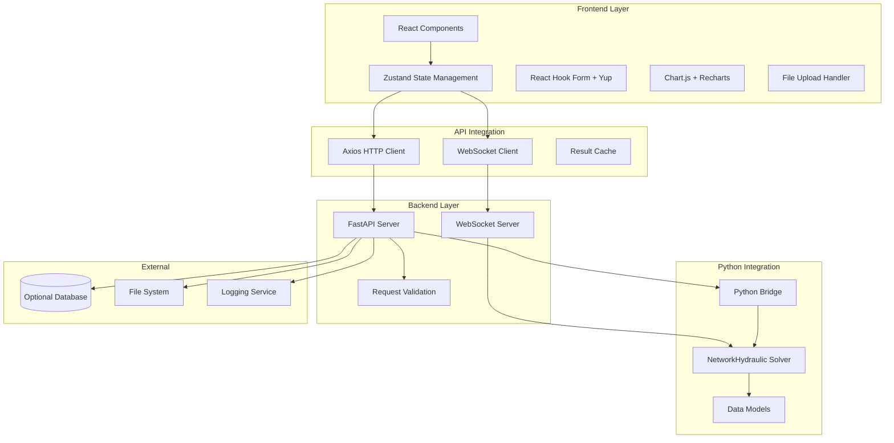
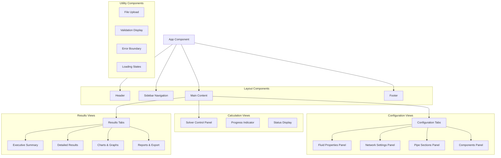
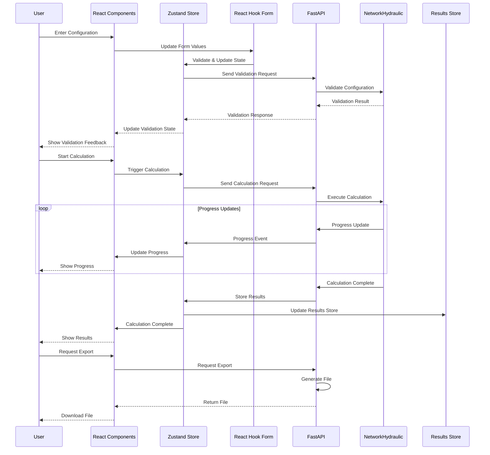
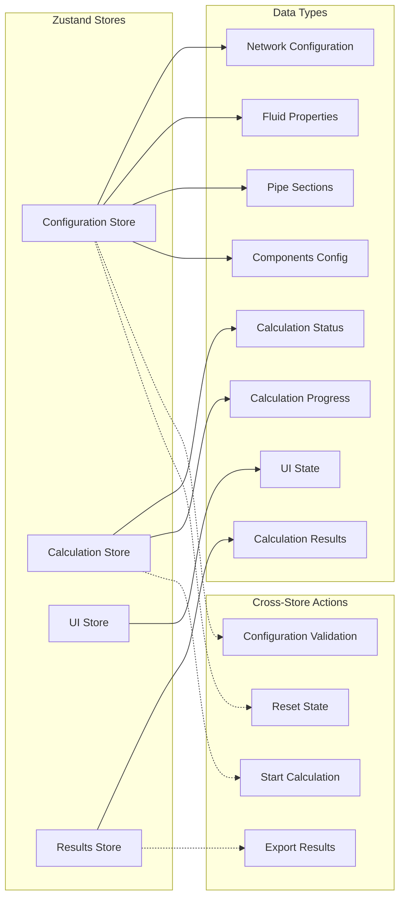
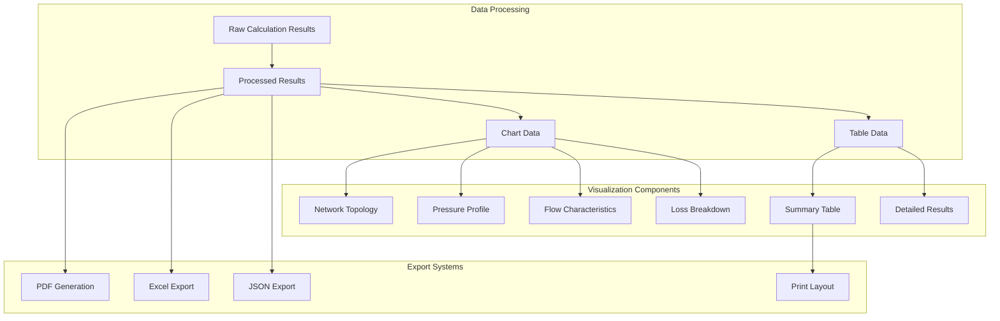
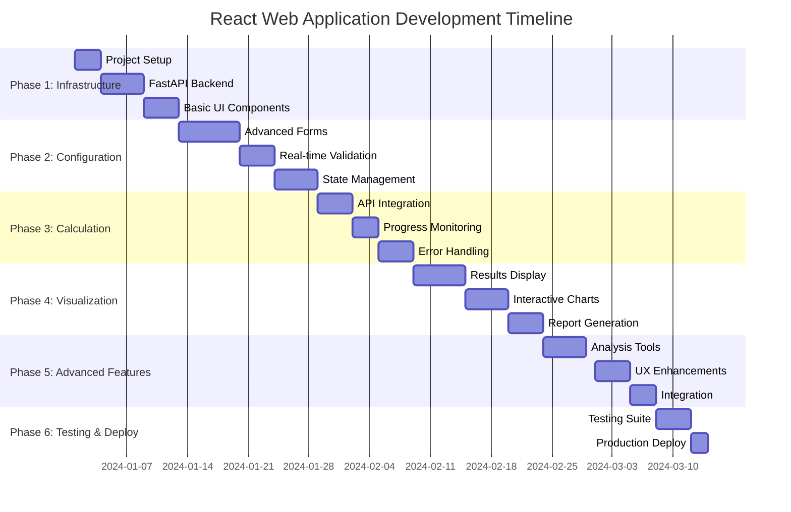

# System Architecture Diagrams

## Application Architecture Overview



## Component Hierarchy



## Data Flow Architecture



## State Management Architecture



## API Architecture

```mermaid
graph TB
    subgraph "API Endpoints"
        ConfigAPI[Configuration API]
        CalcAPI[Calculation API]
        ResultsAPI[Results API]
        SystemAPI[System API]
    end
    
    subgraph "Configuration Endpoints"
        POST Validate[/api/config/validate]
        POST Upload[/api/config/upload]
        GET Templates[/api/config/templates]
        GET Fittings[/api/config/fittings/{type}]
    end
    
    subgraph "Calculation Endpoints"
        POST Calculate[/api/calculate]
        GET Status[/api/calculate/{id}/status]
        POST Cancel[/api/calculate/{id}/cancel]
        GET Stream[/api/calculate/{id}/stream]
    end
    
    subgraph "Results Endpoints"
        GET Result[/api/results/{id}]
        GET Export[/api/results/{id}/export/{format}]
        GET History[/api/history]
        DELETE Delete[/api/results/{id}]
    end
    
    subgraph "System Endpoints"
        GET Status[/api/system/status]
        GET Info[/api/system/info]
    end
    
    ConfigAPI --> Validate
    ConfigAPI --> Upload
    ConfigAPI --> Templates
    ConfigAPI --> Fittings
    
    CalcAPI --> Calculate
    CalcAPI --> Status
    CalcAPI --> Cancel
    CalcAPI --> Stream
    
    ResultsAPI --> Result
    ResultsAPI --> Export
    ResultsAPI --> History
    ResultsAPI --> Delete
    
    SystemAPI --> Status
    SystemAPI --> Info
```

## Results Visualization Architecture



## Implementation Timeline



## User Interaction Flow

```mermaid
stateDiagram-v2
    [*] --> LandingPage
    
    LandingPage --> ConfigureNetwork : Click Start
    ConfigureNetwork --> ConfigureFluid : Next
    ConfigureFluid --> ConfigureNetwork : Back
    
    ConfigureFluid --> ConfigureSections : Next
    ConfigureSections --> ConfigureFluid : Back
    ConfigureSections --> ValidateConfig : Validate
    
    ValidateConfig --> ConfigureSections : Fix Errors
    ValidateConfig --> RunCalculation : Valid
    
    RunCalculation --> ShowResults : Complete
    RunCalculation --> ConfigureNetwork : Cancel
    
    ShowResults --> ExportResults : Export
    ShowResults --> ConfigureNetwork : New Calculation
    ShowResults --> LandingPage : Exit
    
    ExportResults --> ShowResults : Continue
    ExportResults --> LandingPage : Done